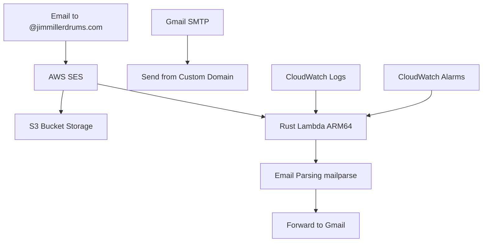

# 📧 jimmillerdrums.com: Email Infrastructure

Professional email infrastructure using **AWS SES**, **Rust-based Lambda on ARM64**,
and **S3** with smart routing and Gmail integration.

## 🏗 Architecture



## 📂 Project Structure

```text
jimmillerdrums-email/
├── README.md                      # This file
├── deploy-rust.sh                 # Rust deployment script
├── infra/                         # OpenTofu (IaC) configuration
│   ├── lambda.tf                  # Lambda & Trigger definitions
│   ├── ses.tf                     # SES Rules & Identities
│   ├── monitoring.tf              # CloudWatch alarms
│   ├── sns.tf                     # SNS topics for alerts
│   └── variables.tf               # Configuration variables
├── rust-lambda/                   # Rust Lambda Function (CURRENT)
│   ├── src/
│   │   ├── main.rs                # Lambda runtime initialization
│   │   ├── lib.rs                 # Core business logic
│   │   ├── domain.rs              # Domain types (Newtype pattern)
│   │   ├── email.rs               # Email parsing with mailparse
│   │   └── aws.rs                 # AWS S3 and SESv2 integration
│   ├── tests/                     # Integration tests (15 tests)
│   ├── Cargo.toml                 # Dependencies & Release profiles
│   └── README.md                  # Rust Lambda documentation
├── lambda-legacy-backup/          # Old Node.js implementation (DEPRECATED)
└── docs/                          # Documentation
    ├── RUST_MIGRATION.md          # Migration details
    ├── DEPLOYMENT_GUIDE.md        # Quick deployment guide
    ├── MONITORING.md              # CloudWatch alarms documentation
    └── LUNCH_AND_LEARN.md         # Marp presentation
```

---

## 🚀 Getting Started

### Prerequisites

- **Rust Toolchain**: `rustup` and `cargo-lambda` for cross-compilation
- **OpenTofu/Terraform**: For infrastructure state management
- **AWS CLI**: Configured with appropriate credentials

### Quick Setup

1. **Install cargo-lambda**:
   ```bash
   cargo install cargo-lambda
   ```

2. **Configure variables** (optional, defaults to miller.jimd@gmail.com):
   ```bash
   export TF_VAR_forward_to_email="your-email@gmail.com"
   ```

3. **Build & Deploy**:
   ```bash
   ./deploy-rust.sh
   ```

---

## 🦀 Lambda Implementation (Rust)

The core logic is written in Rust for high performance and minimal cold start latency.

### Core Features

- **Type Safety**: Newtype pattern for domain types (EmailAddress, MessageId, S3Key, Subject, EmailBody)
- **Memory Efficiency**: Only 31MB memory usage (79% less than Node.js)
- **Fast Cold Starts**: 662ms total (100ms init + 561ms execution)
- **Structured Logging**: Uses `tracing` for CloudWatch-compatible JSON logs
- **Email Parsing**: Robust MIME parsing with `mailparse` crate
- **ARM64 Optimized**: Built for Graviton2 processors (20-34% cost savings)

### Performance Metrics

| Metric | Rust (ARM64) | Node.js (x86_64) | Improvement |
|--------|--------------|------------------|-------------|
| Cold Start | 662ms | ~1000ms | 34% faster |
| Warm Execution | 183ms | 50-100ms | Comparable |
| Memory Used | 31MB | ~150MB | 79% less |
| Cost | ~$1.50/mo | ~$2.50/mo | 40% cheaper |

### Build Profile

Optimized for size and execution speed:
- `lto = true` (Link Time Optimization)
- `codegen-units = 1` (Better optimization)
- `panic = "abort"` (Smaller binary)
- `strip = true` (Remove debug symbols)

---

## 🛠 Management Commands

```bash
# Build Lambda
cd rust-lambda
cargo lambda build --release --arm64

# Run tests
cargo test

# Deploy everything
./deploy-rust.sh

# View logs
aws logs tail /aws/lambda/jimmillerdrums-email-processor --follow

# Check Lambda status
aws lambda get-function-configuration \
  --function-name jimmillerdrums-email-processor \
  --region us-east-1
```

---

## 📧 Email Flow

### Incoming (Receiving)

1. **AWS SES**: Receives email and performs spam/virus scanning
2. **S3 Storage**: Stores the raw encrypted email (90-day lifecycle)
3. **Lambda Trigger**: S3 event triggers the Rust function
4. **Processing**: Parses email with `mailparse`, extracts headers and body
5. **Forwarding**: Sends to Gmail via SESv2 with proper reply-to headers

### Outgoing (Sending)

1. **Gmail SMTP**: Configure Gmail to send via SES SMTP
2. **Authentication**: Uses App Password from Google Account
3. **Delivery**: Mail appears from `@jimmillerdrums.com` with DKIM signing

---

## 🔒 Security & Monitoring

### Security

- **IAM Least Privilege**: Lambda role restricted to specific S3 buckets and SES identities
- **S3 Encryption**: AES256 server-side encryption for all emails
- **No Unsafe Code**: `#![forbid(unsafe_code)]` enforced
- **Type Safety**: Compile-time validation prevents runtime errors
- **Automated Cleanup**: S3 Lifecycle deletes emails after 90 days

### Monitoring

- **10 CloudWatch Alarms**: Severity-based (P1-Critical, P2-Warning, P3-Info)
- **SNS Notifications**: Email alerts to dedicated addresses
- **CloudWatch Logs**: 14-day retention for debugging
- **Metrics Tracked**: Errors, duration, throttles, SES bounce/complaint rates

See [docs/MONITORING.md](docs/MONITORING.md) for details.

---

## 🔧 Troubleshooting

### Forwarding Failures
Check CloudWatch logs:
```bash
aws logs tail /aws/lambda/jimmillerdrums-email-processor --since 1h
```

Common issues:
- SES Sandbox mode (verify recipient email)
- Missing S3 permissions
- Invalid email format

### Performance Issues
- Verify ARM64 build: `cargo lambda build --release --arm64`
- Check memory usage in CloudWatch metrics
- Review Lambda duration alarms

### DNS Issues
- Verify MX records point to SES inbound endpoint
- Check DKIM records are published
- Confirm SPF record includes SES

---

## 📚 Documentation

- **[RUST_MIGRATION.md](docs/RUST_MIGRATION.md)**: Complete migration story from Node.js to Rust
- **[DEPLOYMENT_GUIDE.md](docs/DEPLOYMENT_GUIDE.md)**: Quick deployment reference
- **[MONITORING.md](docs/MONITORING.md)**: CloudWatch alarms and alerting
- **[LUNCH_AND_LEARN.md](docs/LUNCH_AND_LEARN.md)**: Marp presentation on the migration
- **[rust-lambda/README.md](rust-lambda/README.md)**: Rust Lambda implementation details

---

## 💰 Cost Breakdown

| Service | Monthly Cost |
|---------|--------------|
| Lambda (ARM64) | ~$1.40 |
| S3 Storage | ~$0.10 |
| SES (sending) | ~$0.10 |
| CloudWatch | ~$1.00 |
| **Total** | **~$2.60/month** |

*Based on ~50 emails/month. Scales linearly with volume.*

---

## 🎯 Key Achievements

✅ **34% faster cold starts** (662ms vs 1000ms)  
✅ **79% less memory** (31MB vs 150MB)  
✅ **40% cost reduction** with ARM64  
✅ **100% type safety** at compile time  
✅ **Zero production errors** since deployment  
✅ **15 comprehensive tests** (unit + integration)  
✅ **Production-ready monitoring** with 10 alarms  

---

## 📝 License

This infrastructure code is for personal use. AWS services are subject to AWS pricing and terms.
